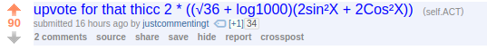

# AyyCT


Python program that will upvote posts on /r/ACT that include a mathematical equation that evaluates to that thicccc 36 *yaaaboy*

# Why is this a thing?

It's [statistically proven](http://www.act.org/) that the only way to actually get a 36 on the ACT is to upvote posts on the frontpage of /r/ACT that contain words like "THICC" or "THIIIRTY SIX" before test day.

This program automates the process of finding/upvoting these posts so you can have more time to study.

# Post Title Examples

[](#)

[](#)

[](#)

[](#)

# How to run

Download requirements by running:

```
$ pip install -r requirements.txt
```

and start the program by running:


```
$ python main.py
```